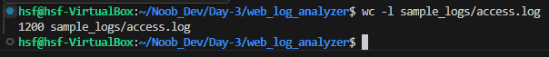
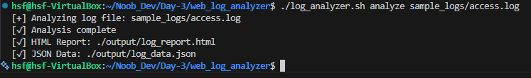
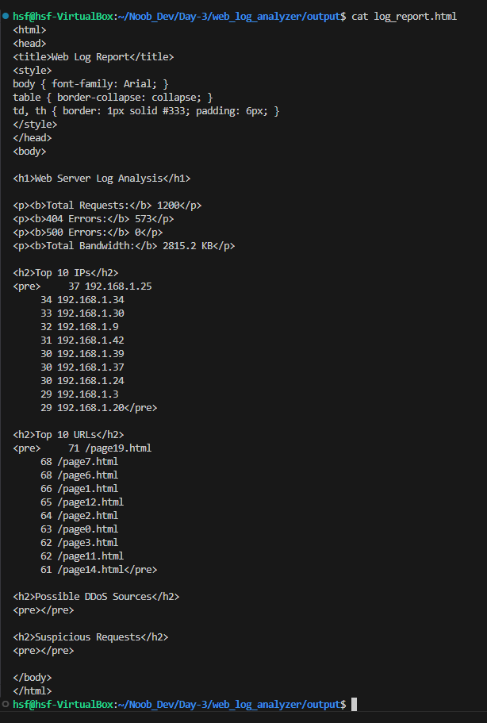
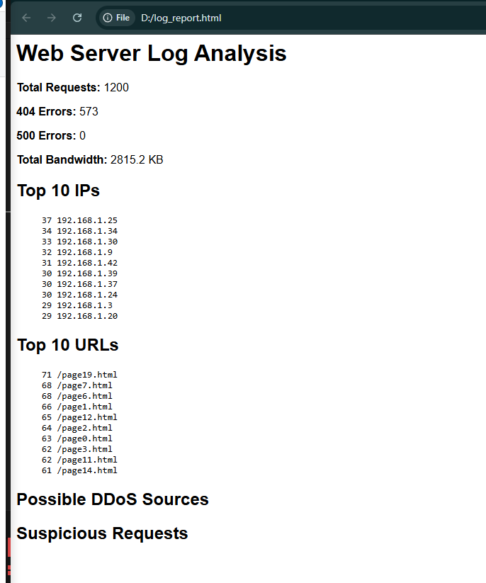

# Sample access.log with 1000+ entries
```bash
for i in {1..1200}; do
  echo "192.168.1.$((RANDOM%50)) - - [$(date '+%d/%b/%Y:%H:%M:%S %z')] \"GET /page$((RANDOM%20)).html HTTP/1.1\" $((RANDOM%2==0?200:404)) $((RANDOM%5000+200))"
done > sample_logs/access.log
```
* **Run this Command inside the Project Folder.**

* Verify Count as Manually
> 

* Generate the File Using :
> ```bash
> ./log_analyzer.sh analyze sample_logs/access.log
> ```
>> 

* Then, Open The Ubuntu Server as GUI form. and Open The Terminal:
> ```bash
> xdg-open output/log_report.html
> ```
>> 

>> 
